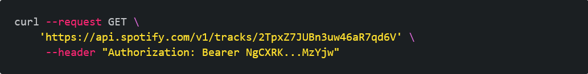
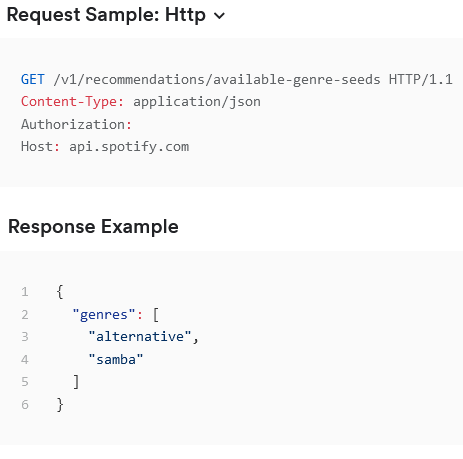
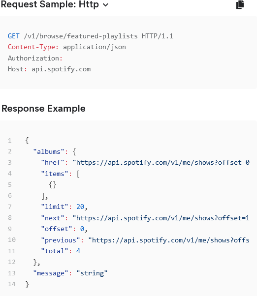

# spotApiProjet
This app uses spotify's Web API to GET Genre data, then Playlist data, then display specfic songs img,artist, and title tags.

Spotify's Client Credentials can be seen here:https://developer.spotify.com/documentation/general/guides/authorization/client-credentials/

Spotify grants a Client ID as well as Client Secret. Using this we make a POST request for a Bearer token that gives us access to pull data from spotify's API.

This is completes the basic authorization flow:https://developer.spotify.com/documentation/general/guides/authorization/use-access-token/
.png)

Dispayed below is the format for using the Bearer token in Curl:

With the Bearer token we have aquired, the next step is actually pulling the data with a Fetch request. The documentation on pulling Genres is listed here:

Next is pulling the playlist data. If we followed the standard, it would pull user playlist data and require log-in credentials; so instead we are pulling the featured playlist data. Documentation below: https://developer.spotify.com/documentation/web-api/reference/#/operations/get-playlist

After pulling the data, we create a interface of classes and Id's that can interface between the HTML files, and the JS files that we are pulling. We do that by defining and inputting the pulled data into template literals that can take that and then using the insert.Adjacent.Html method, reinputting these template literals into the DOM under the same class and ID's they share. 

Once that interface is setup, we merge then with the appController interface. Given that the UI COntroller is essentially an empty vessel, we merge the API contoller which has the actual functionality. We do this using the various Classes, ID,s and methods we've made. 

The layout and styling was done in BOOTSTRAP and inspired by an older version of spotify's

